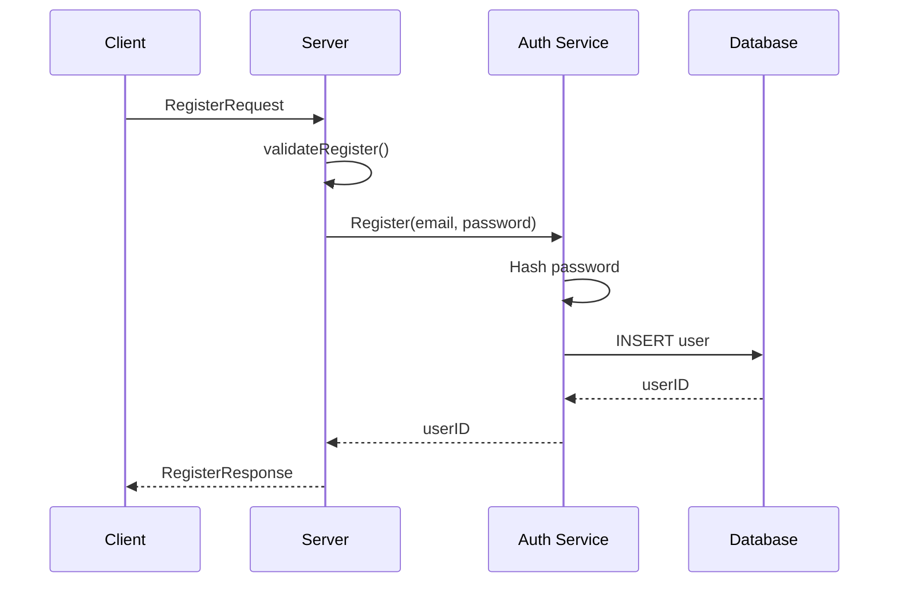
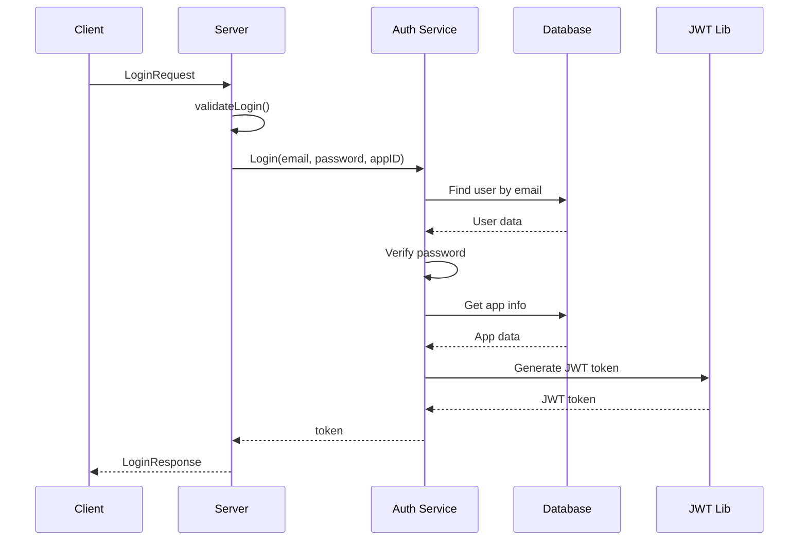
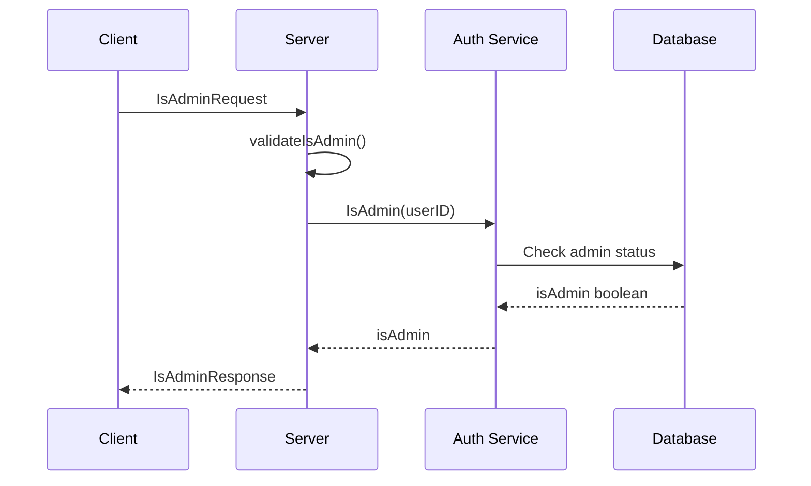

# 🔐 SSO Service

> Централизованный сервис аутентификации и авторизации на основе gRPC и JWT токенов

## 📋 Содержание

- [Описание](#-описание)
- [Архитектура](#-архитектура)
- [Быстрый старт](#-быстрый-старт)
- [API Reference](#-api-reference)
- [Примеры использования](#-примеры-использования)
- [Схемы потоков данных](#-схемы-потоков-данных)
- [Безопасность](#-безопасность)

## 🚀 Описание

SSO (Single Sign-On) сервис предназначен для централизованной аутентификации и авторизации пользователей. Позволяет пользователям войти в систему один раз и получить доступ ко всем связанным приложениям через JWT токены.

### Основные возможности

- ✅ Регистрация новых пользователей
- ✅ Авторизация с выдачей JWT токенов
- ✅ Проверка административных прав
- ✅ Безопасное хранение паролей (хеширование)
- ✅ Поддержка нескольких приложений
- ✅ gRPC API

## 🏗 Архитектура

```
┌─────────────────┐    ┌──────────────────┐    ┌─────────────────┐
│   gRPC Client   │────│  Presentation    │────│  Business Logic │
│   (Postman/App) │    │  Layer           │    │  Layer          │
└─────────────────┘    │  server.go       │    │  auth.go        │
                       └──────────────────┘    └─────────────────┘
                                │                        │
                       ┌──────────────────┐    ┌─────────────────┐
                       │  Storage         │────│  Database       │
                       │  Interface       │    │  SQLite         │
                       │  storage.go      │    │  storage.go     │
                       └──────────────────┘    └─────────────────┘
```

## 🚀 Быстрый старт

### Порядок использования

> ⚠️ **Важно**: Сначала нужно зарегистрироваться, затем авторизоваться!

1. **Регистрация** → получаем `userID`
2. **Авторизация** → получаем JWT токен
3. **Проверка прав** → определяем административные привилегии

## 📡 API Reference

### Методы gRPC

| Метод | Описание | Входные параметры | Результат |
|-------|----------|-------------------|-----------|
| `Register` | Регистрация пользователя | `username`, `password` | `userID` |
| `Login` | Авторизация пользователя | `email`, `password`, `appId` | `token` |
| `IsAdmin` | Проверка прав администратора | `userId` | `isAdmin` |

## 💻 Примеры использования

### 🔧 Postman (gRPC)

#### 1. Регистрация пользователя

```
Method: POST
URL: localhost:44044/auth.Auth/Register
Body Type: gRPC

Request Body:
{
  "username": "john.doe@example.com",
  "password": "securePassword123"
}

Response:
{
  "userId": 12345
}
```

#### 2. Авторизация

```
Method: POST
URL: localhost:44044/auth.Auth/Login
Body Type: gRPC

Request Body:
{
  "email": "john.doe@example.com",
  "password": "securePassword123",
  "appId": 1
}

Response:
{
  "token": "eyJhbGciOiJIUzI1NiIsInR5cCI6IkpXVCJ9..."
}
```

#### 3. Проверка прав администратора

```
Method: POST
URL: localhost:44044/auth.Auth/IsAdmin
Body Type: gRPC

Request Body:
{
  "userId": 12345
}

Response:
{
  "isAdmin": false
}
```

### 🌐 grpcurl (командная строка)

Для тестирования через командную строку можно использовать `grpcurl`:

#### Установка grpcurl
```bash
# macOS
brew install grpcurl

# Windows (через scoop)
scoop install grpcurl

# Linux
go install github.com/fullstorydev/grpcurl/cmd/grpcurl@latest
```

#### Примеры запросов

**Регистрация:**
```bash
grpcurl -plaintext \
  -d '{"username": "test@example.com", "password": "password123"}' \
  localhost:44044 \
  auth.Auth/Register
```

**Авторизация:**
```bash
grpcurl -plaintext \
  -d '{"email": "test@example.com", "password": "password123", "appId": 1}' \
  localhost:44044 \
  auth.Auth/Login
```

**Проверка админ прав:**
```bash
grpcurl -plaintext \
  -d '{"userId": 1}' \
  localhost:44044 \
  auth.Auth/IsAdmin
```

### 🐍 Клиент на Python

```python
import grpc
from generated import auth_pb2, auth_pb2_grpc

# Подключение к серверу
channel = grpc.insecure_channel('localhost:44044')
stub = auth_pb2_grpc.AuthStub(channel)

# Регистрация
register_request = auth_pb2.RegisterRequest(
    username="test@example.com",
    password="password123"
)
register_response = stub.Register(register_request)
user_id = register_response.userId

# Авторизация
login_request = auth_pb2.LoginRequest(
    email="test@example.com",
    password="password123",
    appId=1
)
login_response = stub.Login(login_request)
token = login_response.token

# Проверка прав
admin_request = auth_pb2.IsAdminRequest(userId=user_id)
admin_response = stub.IsAdmin(admin_request)
is_admin = admin_response.isAdmin
```

## 📊 Схемы потоков данных


### 📈 Общий поток данных

1. **gRPC Client** отправляет запрос  
   ⬇️  
2. **internal/grpc/auth/server.go** (_Presentation Layer_)  
   - Принимает запрос, валидирует входные данные  
   - Вызывает: `s.auth.Login(ctx, email, password, appID)`  
   ⬇️  
3. **internal/services/auth/auth.go** (_Business Logic Layer_)  
   - Выполняет бизнес-логику авторизации  
   - Вызывает: `a.userProvider.User(ctx, email)` — получение пользователя  
   - Вызывает: `a.userProvider.IsAdmin(ctx, userID)` — проверка прав  
   ⬇️  
4. **internal/storage/storage.go** (_Storage Interface_)  
   - Абстрактный интерфейс, определяющий методы работы с хранилищем  
   ⬇️  
5. **internal/storage/sqlite/storage.go** (_Database Layer_)  
   - Прямая работа с БД  
   - SQL-запросы: `SELECT`, `INSERT`, `UPDATE`  
   - Маппинг результатов в доменные объекты  
   ⬇️  
6. **internal/lib/jwt/jwt.go** (_Utility Layer_)  
   - Генерация JWT токена при успешной аутентификации  
   ⬇️  
7. **Ответ возвращается клиенту по цепочке слоёв**  
   - ✅ В случае успеха: возвращается JWT токен  
   - ❌ В случае ошибки: возвращается ошибка с соответствующим кодом  
   - Ошибки обрабатываются на каждом уровне и возвращаются клиенту  
   - Возможные коды ошибок: `InvalidArgument`, `Internal`, `NotFound`, `Unauthenticated`


### 🔄 Регистрация пользователя



### 🔑 Авторизация



### 👑 Проверка админ прав



## 🔒 Безопасность

### Хранение паролей
- ✅ Пароли хешируются перед сохранением в БД
- ✅ Используется криптографически стойкое хеширование
- ❌ Пароли в открытом виде не хранятся

### JWT токены
- ⏰ Ограниченное время жизни (TTL)
- 🔐 Подписываются секретным ключом приложения
- 📱 Содержат информацию о пользователе и приложении

### Валидация
- 🛡️ Многоуровневая валидация данных
- 🔍 Проверка на уровне gRPC handler'ов
- ✅ Бизнес-валидация в сервисном слое

## 🎯 Что означает IsAdmin?

**IsAdmin** - проверка административных привилегий пользователя:

- 👤 Определяет права доступа к административным функциям
- 🔧 Используется для контроля доступа к панели управления
- 📊 Позволяет разграничить обычных пользователей и администраторов
- ⚙️ Примеры использования: управление пользователями, изменение настроек системы

## 📝 Коды ошибок

| Код | Описание |
|-----|----------|
| `InvalidArgument` | Некорректные входные данные |
| `Internal` | Внутренняя ошибка сервера |
| `NotFound` | Пользователь не найден |
| `Unauthenticated` | Неверный пароль |

## 🤝 Зависимости между запросами

```
┌─────────────┐     ┌─────────────┐     ┌─────────────┐
│  Register   │────▶│   Login     │────▶│   IsAdmin   │
│             │     │             │     │             │
│ Создает     │     │ Требует     │     │ Требует     │
│ userID      │     │ userID      │     │ userID      │
└─────────────┘     └─────────────┘     └─────────────┘
```

> **Примечание**: Login требует предварительной регистрации, IsAdmin требует знания userID

---

<div align="center">

**🚀 Готов к использованию!**

*Для получения дополнительной информации обратитесь к документации API или создайте issue в репозитории.*

</div>
